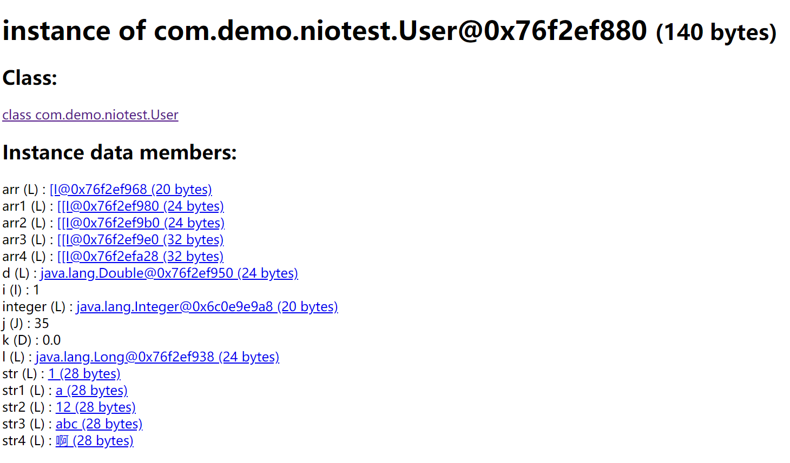
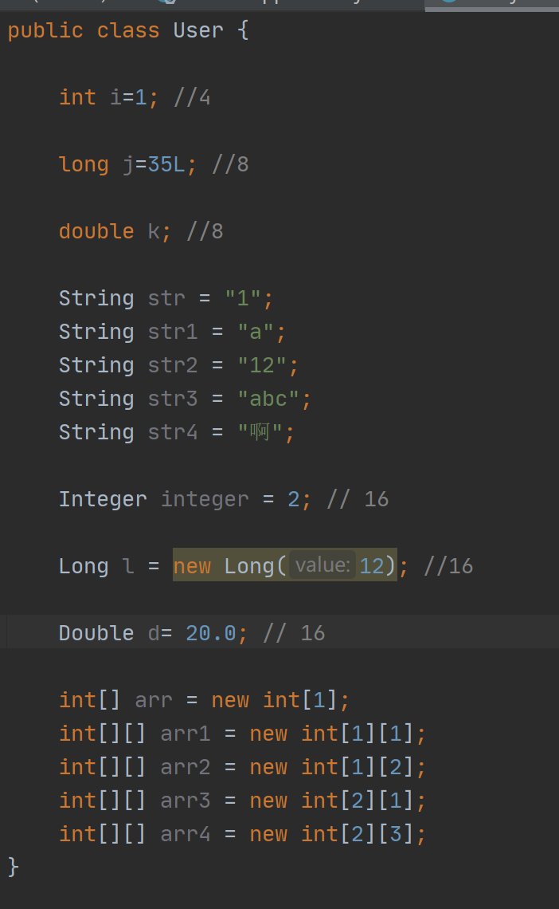

##jhat 练习

```text
$> jps
...
27124 NiotestApplication
...
$> jmap -dump:format=b,file=jhatdemo 27124
Dumping heap to D:\jhatdemo ...
Heap dump file created
$> jhat jhatdemo
Reading from jhatdemo...
Dump file created Wed Oct 28 14:54:11 CST 2020
Snapshot read, resolving...
Resolving 308218 objects...
Chasing references, expect 61 dots.............................................................
Eliminating duplicate references.............................................................
Snapshot resolved.
Started HTTP server on port 7000
Server is ready.
```

> 访问 http://localhost:7000/


> 包含16个成员变量的User类 140byte
> 第一次计算: 
> 4(int) + 8(long) + 8(double) + 
> (5 * 28)(String) + (16 + 4)(Integer) + 
> (16 + 8)(Long) + (16 + 8)(Double) + 
> (16 + 4)(int[1]) + (16 + 4 + 4)(int[1][1])
> (16 + (4 + 4) * 1) (int[1][2]) + (16 + (4 + 4) * 2)(int[2][1])
> (16 + (4 + 4) * 2) (int[2][3]) = 360 
> 查资料找到如果是对象的话 应该计算的是对象的引用大小而不是实际大小 而且还有指针压缩
> 
> 分析得出 数组部分 16 表示的是数组本身占用字节数 4表示下标占用的字节数 这个字节数的占用和数组真正占用大小无关
> 及 一维数组 16 + 4 
>
> 二维数组
```text
[1][] = 16 + (4 + 4) = 24
[2][] = 16 + (4 + 4) +
             (4 + 4) = 32
[3][] = 16 + (4 + 4) +
             (4 + 4) +
             (4 + 4) = 40
[4][] = 16 + (4 + 4) +
             (4 + 4) +
             (4 + 4) + 
             (4 + 4) = 48
```
>        
> 总结 
>Integer 这种对象本身占 16 不算赋值 赋值后 +4字节(int本身的字节)
> Long同理 
