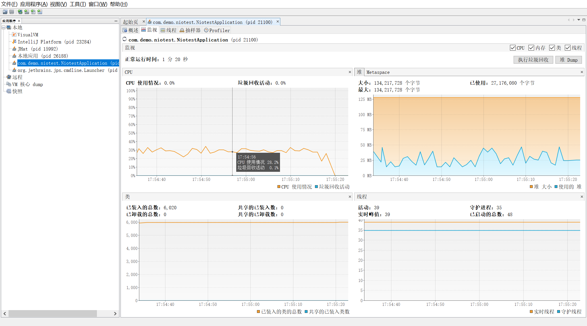
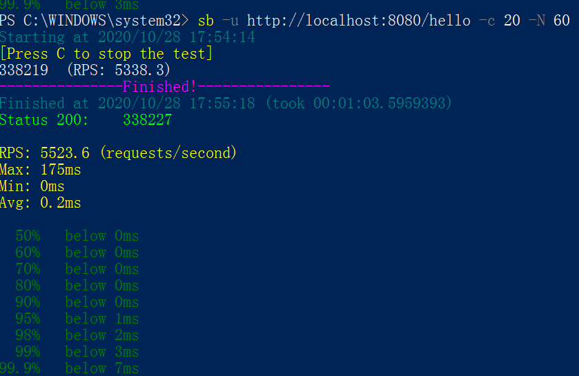
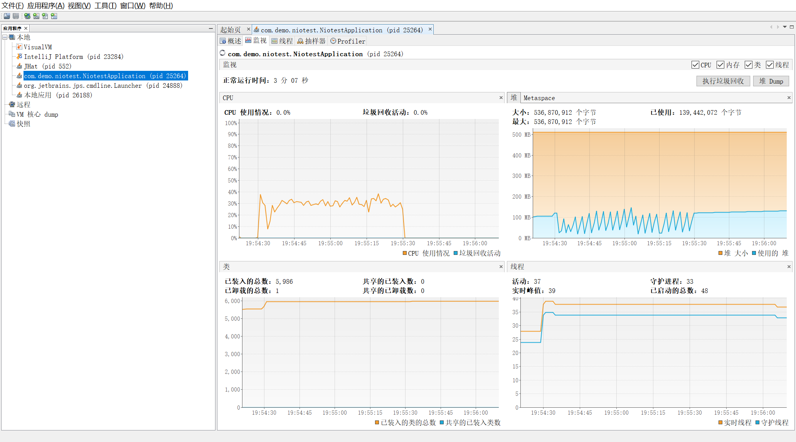
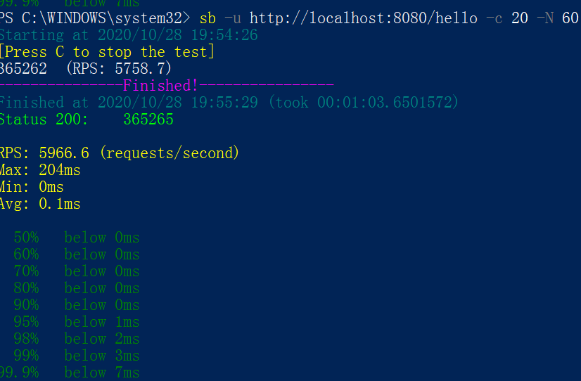
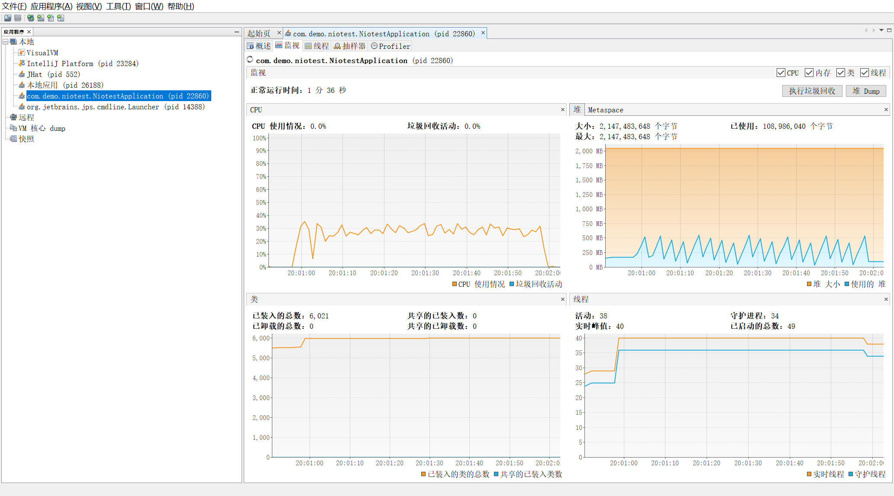
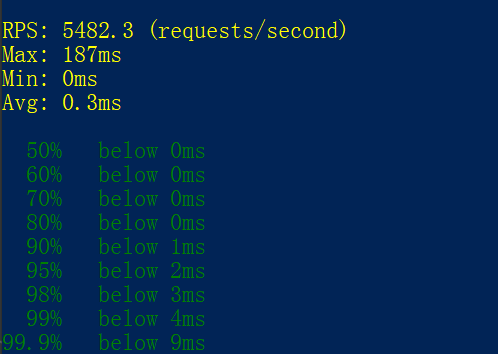

#压力测试
##SerialGC
> -Xms128m -Xmx128m -XX:+UseSerialGC

> 测试结果如图

> -Xms512m -Xmx512m -XX:+UseSerialGC

> 相比于上一次提升400左右RPS 平均延迟降低0.1ms

> -Xms2g -Xmx2g -XX:+UseSerialGC

> 相比于上一次降低 400RPS 平均延迟提升0.2ms